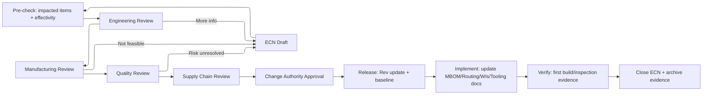

# ECN Workflow (Mermaid)

> Tip: In VS Code, install a Mermaid preview extension OR just view this on GitHub later.

```mermaid
---
config:
  layout: elk
---
flowchart LR
A[ECN Draft] --> B[Pre-check: impacted items + effectivity]
B --> C[Engineering Review]
C --> D[Manufacturing Review]
D --> E[Quality Review]
E --> F[Supply Chain Review]
F --> G[Change Authority Approval]
G --> H[Release: Rev update + baseline]
H --> I[Implement: update MBOM/Routing/WIs/Tooling docs]
I --> J[Verify: first build/inspection evidence]
J --> K[Close ECN + archive evidence]

C -->|More info| A
D -->|Not feasible| A
E -->|Risk unresolved| A
```
